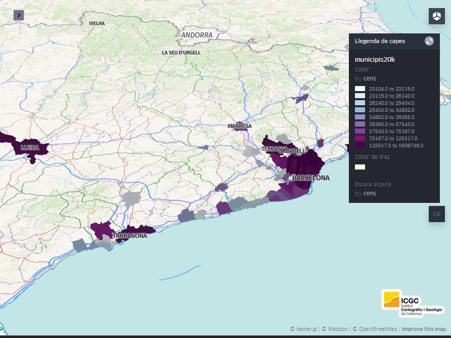

# Template  Map Viewer based on Kepler.GL
 
  [KeplerGL](https://kepler.gl/),  ReactJs + Webpack template


### Sources:

[Kepler.GL api reference](https://docs.kepler.gl/docs/api-reference)

ContextMaps Vector-Tiles MapBox Styles from [OpenICGC](https://openicgc.github.io/)


## Get started

*Note that you will need to have [Node.js](https://nodejs.org) installed.*

Clone and install the dependencies...

```bash
git clone https://github.com/geostarters/keplergl-template-app.git

cd keplergl-template-app

npm install

npm run start

```



## Building and running in production mode

To create an optimised version of the app in  ```/public```  folder:

```bash
npm run build
```
